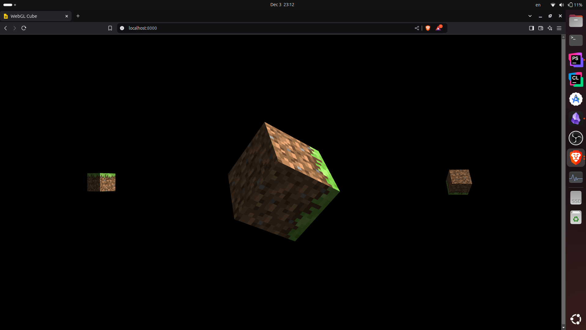

# WebGL Cube

## Overview
This is a simple WebGL2 3D cube implementation with the following features:
- VBO, EBO, VAO.
- Shader Program
- Camera Projection(Perspective)
- Phong shading


## How to Run

Project uses Esbuild for bundling application. By default minification is turned off. This is because for better development experience and debugging.
```serve.mts``` file is esbuild script file to configure build process. for more development options checkout npm scripts.

to run application run 
```npm run serve```

